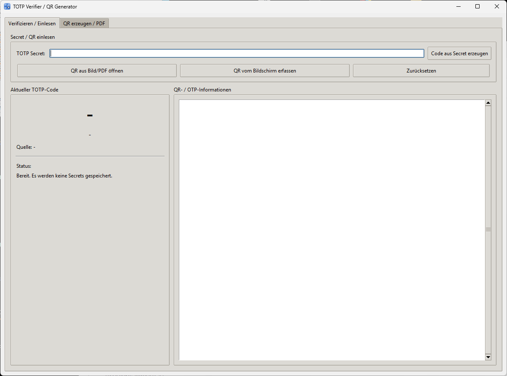
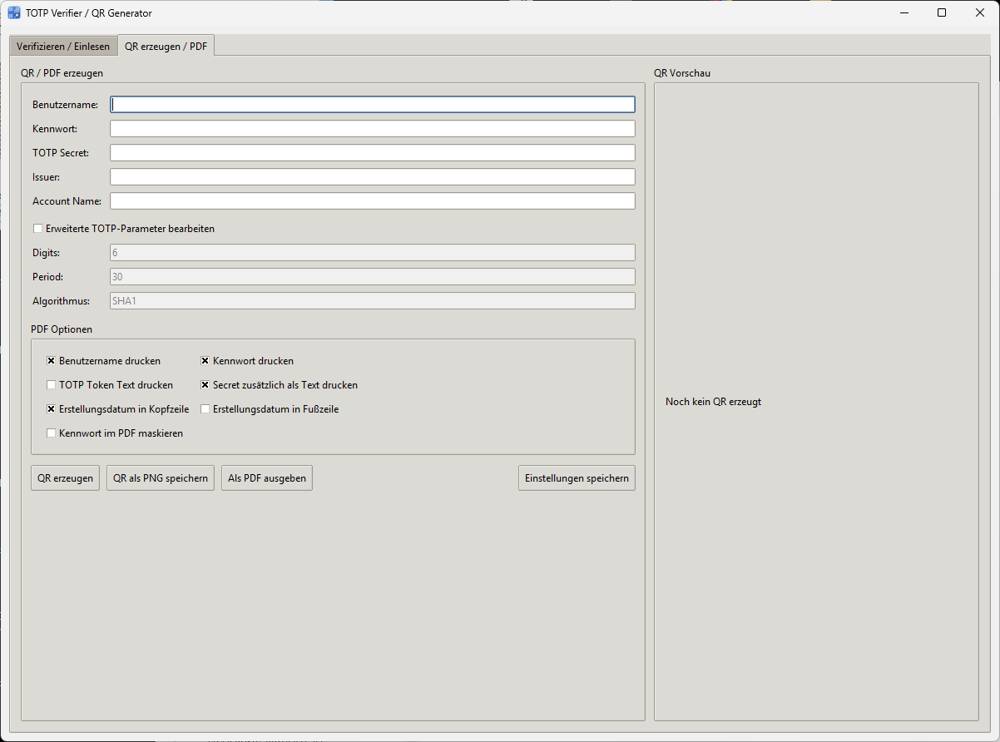

# TOTP Verifier / QR Generator

Ein lokales Windows-Tool zum **Verifizieren von TOTP-Secrets** und zum **Erzeugen von TOTP-QR-Codes** inklusive **PDF-Ausgabe**.

Die Anwendung ist für den praktischen Einsatz als Hilfswerkzeug gedacht, wenn TOTP-Secrets geprüft, aus QR-Codes ausgelesen oder neue QR-Codes für Registrierungsunterlagen erzeugt werden sollen.

> [!IMPORTANT]
> Die Anwendung verarbeitet sicherheitsrelevante Daten wie TOTP-Secrets und optional auch Kennwörter.  
> Vor produktivem Einsatz sollte geprüft werden, ob die Nutzung den internen Sicherheitsvorgaben entspricht.

---

## Inhaltsverzeichnis

- [Überblick](#überblick)
- [Screenshots](#screenshots)
- [Funktionsumfang](#funktionsumfang)
  - [Verifizieren / Einlesen](#verifizieren--einlesen)
  - [QR erzeugen / PDF](#qr-erzeugen--pdf)
  - [Automatische Datenübernahme](#automatische-datenübernahme)
- [PDF-Ausgabe](#pdf-ausgabe)
- [Dateinamen beim Export](#dateinamen-beim-export)
- [Sicherheit und Speicherung](#sicherheit-und-speicherung)
- [Sprachdatei](#sprachdatei)
- [Konfigurationsdatei](#konfigurationsdatei)
- [Verwendete Bibliotheken](#verwendete-bibliotheken)
- [Voraussetzungen](#voraussetzungen)
- [Installation](#installation)
- [Portable EXE kompilieren](#portable-exe-kompilieren)
- [Projektstruktur](#projektstruktur)
- [Typischer Workflow](#typischer-workflow)
- [Bekannte Hinweise](#bekannte-hinweise)
- [Haftungsausschluss](#haftungsausschluss)
- [Nutzungshinweis](#nutzungshinweis)

---

## Überblick

Die Anwendung dient dazu, TOTP-Daten lokal zu verarbeiten und zu prüfen.

Sie kann:

- TOTP-Secrets manuell entgegennehmen
- QR-Codes aus Bildern, PDFs und Screenshots auslesen
- daraus den aktuellen TOTP-Code erzeugen
- neue TOTP-QR-Codes erzeugen
- Registrierungsblätter als PDF ausgeben

---

## Screenshots

### Registerkarte „Verifizieren / Einlesen“



### Registerkarte „QR erzeugen / PDF“



---

## Funktionsumfang

### Verifizieren / Einlesen

Folgende Eingangswege werden unterstützt:

- **Manuelle Eingabe eines TOTP-Secrets**
- **Einlesen eines QR-Codes aus Bilddateien**
  - PNG
  - JPG / JPEG
- **Einlesen eines QR-Codes aus PDF-Dateien**
- **Einlesen eines QR-Codes direkt vom Bildschirm**
  - per Screenshot-Auswahl

Nach dem Einlesen werden – sofern vorhanden – Zusatzinformationen angezeigt, zum Beispiel:

- OTP-Typ
- Label
- Issuer
- Account Name
- Algorithmus
- Digits
- Period
- Secret
- Rohinhalt des QR-Codes

Zusätzlich wird aus dem Secret direkt der aktuelle **TOTP-Code** erzeugt und laufend aktualisiert.

---

### QR erzeugen / PDF

Die Anwendung kann aus einem vorhandenen TOTP-Secret einen neuen QR-Code erzeugen.

#### Eingabefelder

- Benutzername
- Kennwort
- TOTP Secret
- Issuer
- Account Name

#### Erweiterte TOTP-Parameter

Die Felder

- Digits
- Period
- Algorithmus

sind standardmäßig **gesperrt und ausgegraut**.

Sie werden erst bearbeitbar, wenn die Checkbox  
**„Erweiterte TOTP-Parameter bearbeiten“** aktiviert wird.

#### Ausgabeoptionen

- QR-Code als **PNG speichern**
- Registrierungsblatt als **PDF erzeugen**

---

### Automatische Datenübernahme

Wenn im Register **„Verifizieren / Einlesen“** Daten eingelesen werden, werden diese automatisch in das Register **„QR erzeugen / PDF“** übernommen.

Das gilt für:

- manuelle Secret-Eingabe
- QR aus Bild
- QR aus PDF
- QR vom Bildschirm

#### Übernommene Werte

| Feld | Wird übernommen |
|---|---|
| TOTP Secret | Ja |
| Issuer | Ja, falls vorhanden |
| Account Name | Ja, falls vorhanden |
| Benutzername | Ja |
| Digits | Ja |
| Period | Ja |
| Algorithmus | Ja |

---

## PDF-Ausgabe

Die PDF-Ausgabe ist für Registrierungs- oder Übergabeunterlagen gedacht.

### Optional ausgebbare Inhalte

- Benutzername
- Kennwort
- TOTP Token
- TOTP Secret
- Erstellungsdatum in Kopfzeile
- Erstellungsdatum in Fußzeile

### Layout

Die Felder werden im PDF sauber in **zwei Spalten** ausgegeben:

| Linke Spalte | Rechte Spalte |
|---|---|
| Feldbezeichnung | Feldwert |

Zusätzlich wird der erzeugte QR-Code auf dem PDF platziert.

### Beispielhafte Inhalte im PDF

- Benutzername
- Kennwort
- TOTP Token Secret
- QR-Code
- Erstellungsdatum

> [!WARNING]
> Ein PDF, das sowohl **Kennwort** als auch **TOTP-Daten** enthält, ist hochsensibel und sollte nur in sicheren Prozessen verwendet werden.

---

## Dateinamen beim Export

Beim Speichern von PNG- oder PDF-Dateien wird automatisch ein Dateiname vorgeschlagen.

### Mit Benutzername

```text
<Benutzername>_<DDMMYYYY>.png
<Benutzername>_<DDMMYYYY>.pdf
```

### Ohne Benutzername

```text
totp_<DDMMYYYY>.png
totp_<DDMMYYYY>.pdf
```

---

## Sicherheit und Speicherung

Die Anwendung ist so ausgelegt, dass **Secrets nicht dauerhaft gespeichert werden**, außer der Benutzer exportiert bewusst Inhalte als Datei.

### Gespeichert werden

- Checkbox-Einstellungen für die PDF-Ausgabe

### Nicht automatisch gespeichert werden

- TOTP-Secrets
- QR-Inhalte
- Kennwörter
- zuletzt gelesene Daten

---

## Sprachdatei

Die Anwendung unterstützt ein optionales Language-File:

```text
totp_verifier_language.json
```

Dieses File muss im selben Ordner liegen wie das Script oder die EXE.

### Verhalten

- Wenn **keine** Sprachdatei vorhanden ist, werden die eingebauten Standardtexte verwendet.
- Wenn eine Sprachdatei vorhanden ist, werden **nur die dort definierten Strings** ersetzt.
- Nicht definierte Keys bleiben auf dem Standardwert.

### Die Sprachdatei wirkt auf

- Buttons
- Dialoge
- Statusmeldungen
- PDF-Ausgabe
- weitere UI-Texte

### Beispiel

```json
{
  "app_title": "TOTP Verifier / QR Generator",
  "btn_generate_qr": "QR erzeugen",
  "btn_export_pdf": "Als PDF ausgeben"
}
```

---

## Konfigurationsdatei

Checkbox-Einstellungen werden in einer JSON-Datei gespeichert:

```text
totp_verifier_settings.json
```

Diese Datei liegt im selben Ordner wie das Programm bzw. die EXE.

---

## Verwendete Bibliotheken

Die Anwendung verwendet unter anderem folgende Python-Pakete:

- `pyotp`
- `pillow`
- `opencv-python-headless`
- `pymupdf`
- `numpy`
- `segno`
- `reportlab`

---

## Voraussetzungen

| Komponente | Empfehlung |
|---|---|
| Betriebssystem | Windows |
| Python | 3.10 oder neuer |
| Paketmanager | pip |

---

## Installation

### Abhängigkeiten installieren

```bat
python -m pip install pyotp pillow opencv-python-headless pymupdf numpy segno reportlab
```

### Anwendung direkt als Python-Script starten

```bat
python totp_verifier.py
```

---

## Portable EXE kompilieren

Zum Erzeugen einer **einzigen portablen EXE** wird `PyInstaller` verwendet.

### Voraussetzungen

Folgende Dateien sollten sich im selben Ordner befinden:

- `totp_verifier.py`
- `make.bat`
- `totp_verifier_icon.ico`

Optional zusätzlich:

- `totp_verifier_language.json`
- `totp_verifier_settings.json`

### Build starten

```bat
make.bat
```

### Was die Build-Datei macht

Die `make.bat`:

- erkennt automatisch die Python-Datei
- installiert benötigte Build-Abhängigkeiten
- verwendet **PyInstaller**
- erzeugt eine **portable One-File-EXE**
- bindet optional ein:
  - Icon
  - Sprachdatei
  - Settings-Datei

### Technische Details

Die EXE wird sinngemäß so gebaut:

```bat
python -m PyInstaller ^
  --noconfirm ^
  --clean ^
  --onefile ^
  --windowed ^
  --name "TOTPVerifier" ^
  --icon totp_verifier_icon.ico ^
  --add-data totp_verifier_language.json;. ^
  --add-data totp_verifier_settings.json;. ^
  --add-data totp_verifier_icon.ico;. ^
  totp_verifier.py
```

### Ergebnis

Nach erfolgreichem Build befindet sich die EXE hier:

```text
dist\\TOTPVerifier.exe
```

> [!NOTE]
> Wenn eine externe Sprachdatei verwendet werden soll, legen Sie `totp_verifier_language.json` zusätzlich neben die EXE.

---

## Projektstruktur

```text
.
├── totp_verifier.py
├── make.bat
├── totp_verifier_icon.ico
├── totp_verifier_language.json
├── totp_verifier_settings.json
├── 1.png
├── 2.png
└── dist
    └── TOTPVerifier.exe
```

---

## Typischer Workflow

### Secret prüfen

1. Anwendung starten
2. Zum Register **„Verifizieren / Einlesen“** wechseln
3. Secret manuell eingeben oder QR laden
4. Aktuellen TOTP-Code ablesen
5. Details prüfen

### QR neu erzeugen

1. Secret im Register **„Verifizieren / Einlesen“** laden  
   **oder**
2. Daten direkt im Register **„QR erzeugen / PDF“** eintragen
3. QR erzeugen
4. Optional als PNG speichern
5. Optional PDF ausgeben

---

## Bekannte Hinweise

- QR-Erkennung aus PDF hängt von Qualität und Auflösung der PDF ab.
- Sehr kleine oder stark komprimierte QR-Codes sind schwieriger zu erkennen.
- Bei mehrseitigen PDFs wird abgefragt, auf welcher Seite sich der QR-Code befindet.
- Die erweiterten TOTP-Parameter sind bewusst standardmäßig deaktiviert.
- Eine One-File-EXE kann relativ groß werden, da Python-Laufzeit und Abhängigkeiten eingebettet werden.

---

## Haftungsausschluss

Dieses Tool wird **ohne jegliche Garantien oder Zusicherungen** und **„as-is“** bereitgestellt.

Insbesondere wird keine Gewährleistung übernommen für:

- Funktionsfähigkeit ohne Fehler
- Eignung für einen bestimmten Zweck
- Vollständigkeit oder Richtigkeit der Ergebnisse
- Kompatibilität mit bestimmten Systemumgebungen
- Sicherheit, Verfügbarkeit oder unterbrechungsfreien Betrieb

Die Nutzung erfolgt ausschließlich **auf eigene Verantwortung**.

Soweit gesetzlich zulässig, übernehmen die Autoren, Bereitsteller oder Mitwirkenden **keine Haftung** für direkte oder indirekte Schäden, Folgeschäden, Datenverluste, Sicherheitsvorfälle oder sonstige Nachteile, die aus der Nutzung, Nichtnutzung oder fehlerhaften Nutzung dieses Tools entstehen.

---

## Nutzungshinweis

Dieses Projekt ist als internes oder individuelles Hilfswerkzeug gedacht.

Vor produktivem Einsatz sollte geprüft werden, ob die Verarbeitung von Secrets, Kennwörtern und Registrierungsunterlagen den internen Sicherheitsvorgaben entspricht.
